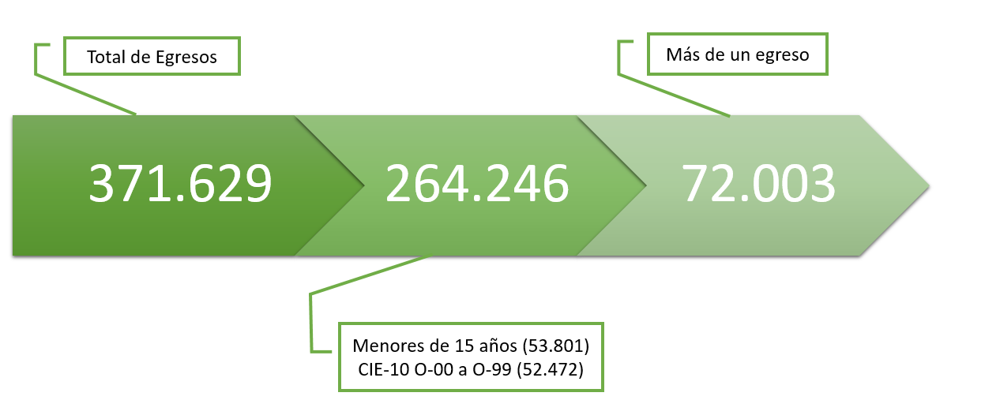

```{r xaringan-themer, include=FALSE, warning=FALSE}
library(xaringanthemer)
style_mono_accent(
  base_color = "#E83C3C",
  header_font_google = google_font("Josefin Sans", "400"),
  header_h1_font_size = "2.2rem",
  text_font_google   = google_font("Montserrat", "300", "300i"),
  code_font_google   = google_font("Fira Mono")
)
```


AUTORIDADES COMISIÓN DIRECTIVA HONORARIA

Dra. Graciela Dighiero Arrarte   
Presidente - Delegada del Poder Ejecutivo     
Prof. Dr. Ricardo Lluberas    
Vicepresidente - Delegado de la Facultad de Medicina    
Dr. Walter Reyes Caorsi     
Secretario Delegado de la Sociedad Uruguaya de Cardiología     
Dr. Juan J. Pereyra 
Tesorero - Delegado del Sindicato Médico del Uruguay    
Dr. Ramiro Draper      
Delegado del Ministerio de Salud Pública
Sr. Carlos Costa     
Delegado de Asociación Procardias     
Dra. Alicia López     
Delegada de la Federación Médica del Interior    
Dra. Laura Garré    
Directora Ejecutiva

```{r setup, include=FALSE, echo = FALSE}
options(htmltools.dir.version = FALSE)
```

???

Image credit: [Wikimedia Commons](https://commons.wikimedia.org/wiki/File:Sharingan_triple.svg)

---
class: center

# Salud cardiovascular en el Uruguay: una mirada poblacional


--

- Mortalidad 2019

--

- Egresos hospitalarios 2018
    


---

# Propósito

--


- Reportar la mortalidad por ECV correspondiente al año 2019 y su evolución entre los años 2005-2019


--

- Analizar la información sobre mortalidad por ECV y contextualizarlas con las restantes causas de mortalidad

--


---


# Metodología

--


- Las patologías de estudio del Área son las definidas como _“Enfermedades del Sistema Circulatorio”_ por la Organización Mundial de la Salud (OMS) en la 10ª  Revisión de la Clasificación Internacional de Enfermedades (CIE-10)

--

- Fuente de datos: MSP

--

---
class: inverse, center, middle

# Mortalidad por enfermedades cardiovasculares


---
class: center

# Mortalidad global

```{r, message=FALSE, warning=FALSE, echo=FALSE}
library(tidyverse)
library(lubridate)
library(dplyr)
library(readxl)
library(stringr)
library(openair)
library(scales)#para pie chart ggplot
library(plotly)
library(gridExtra)
library(knitr)
library(kableExtra)
library(readxl)

library(RColorBrewer)
library(gridExtra)
library(grid)
library(extrafont)
library(plotly)
library(viridis)
library(forcats)

library(ggiraph)
library(ggiraphExtra)
library(ggthemes)
library(maptools)
library(rgdal)
library(ggthemes)
library(scales)
library(plotrix)
library(gdata)
library(sp)
library(sf)
library(stringi)
```

```{r, warning=FALSE, message=FALSE, echo=FALSE}
load("mortalidad_2019.RData")
```

```{r, echo=FALSE, message=FALSE, warning=FALSE}
#sin fetales
#TramoEtario identifica 1:Fetal, 2: 0 a 6 días, 3: 7 días a 27 días, 4: 28 días a 364 días, 5: Mayor a 1 año 
#Hay 284 fetales, 132 de 0 a 6 días, 54 de 7 dias a 27 dias y 87 28 a 364 días se excluyen del análisis

mortalidad_2019 <- mortalidad_2019[mortalidad_2019$TramoEtario != "Fetal", ]
```

```{r, echo=FALSE, message=FALSE, warning=FALSE}
#mortalidad_2018$fecha_nacimiento <- ymd(mortalidad_2018$fecha_de_nacimiento)
#mort_2017$fecha_def <- ymd(mort_2017$FechadelaDefuncion)

age <- function(from, to) {
  from_lt = as.POSIXlt(from)
  to_lt = as.POSIXlt(to)
  
  age = to_lt$year - from_lt$year
  
  ifelse(to_lt$mon < from_lt$mon |
           (to_lt$mon == from_lt$mon & to_lt$mday < from_lt$mday),
         age - 1, age)
}
#https://stackoverflow.com/questions/37880975/spss-date-format-when-imported-into-r
pss2date <- function(x) as.Date(x/86400, origin = "1582-10-14")
mortalidad_2019$edad <- age(from = pss2date(mortalidad_2019$FechadeNacimiento),
                      to = pss2date(mortalidad_2019$FechadelaDefuncion))

```

```{r, echo=FALSE, message=FALSE, warning=FALSE}
mortalidad_2019$fecha_def <- pss2date(mortalidad_2019$FechadelaDefuncion)
```


```{r, echo=FALSE, message=FALSE, warning=FALSE}
mortalidad_2019_I <- mortalidad_2019[grepl("I+", mortalidad_2019$EnfermedadcausanteCIE10), ]
```


```{r causas, echo=FALSE, message=FALSE, warning=FALSE}
mortalidad_2019_I$causa_texto <-
  ifelse(
    grepl("I2(0|1|2|3|4|5)+", mortalidad_2019_I$EnfermedadcausanteCIE10),
    "Enfermedades isquémicas del corazón (I20-I25)",
    ifelse(
      grepl("I6+", mortalidad_2019_I$EnfermedadcausanteCIE10),
      "Enfermedades cerebrovasculares (I60-I69)",
      ifelse(
        grepl("I3+", mortalidad_2019_I$EnfermedadcausanteCIE10) |
          grepl("I4(0|1|2|3|4|5|7|8|9)+", mortalidad_2019_I$EnfermedadcausanteCIE10) |
          grepl("I5(1|2)+", mortalidad_2019_I$EnfermedadcausanteCIE10),
        "Otras formas de enf. del corazón (I30-I45/I47-I49/I51-I52)",
        ifelse(
          grepl("I50", mortalidad_2019_I$EnfermedadcausanteCIE10),
          "Insuficiencia cardíaca (I50)",
          ifelse(
            grepl("I46", mortalidad_2019_I$EnfermedadcausanteCIE10),
            "Paro cardíaco (I46)",
            ifelse(
              grepl("I1(0|1|2|3|4|5)+", mortalidad_2019_I$EnfermedadcausanteCIE10),
              "Enfermedades hipertensivas (I10-I15)",
              ifelse(
                grepl("I7+", mortalidad_2019_I$EnfermedadcausanteCIE10),
                "Enf. de las arterias, de las arteriolas y de los vasos capilares (I70-I79) ",
                ifelse(
                  grepl("I2(6|7|8)+", mortalidad_2019_I$EnfermedadcausanteCIE10),
                  "Enf. cardiopulmonar (I26-I28)",
                  ifelse(
                    grepl("I8+", mortalidad_2019_I$EnfermedadcausanteCIE10),
                    "Enf. de las venas y de los vasos y ganglios linfáticos (I80-89)",
                    ifelse(
                      grepl("I9(5|6|7|8|9)+", mortalidad_2019_I$EnfermedadcausanteCIE10),
                      "Otros trastornos (I95-I99)",
                      ifelse(
                        grepl("I0(5|6|7|8|9)+", mortalidad_2019_I$EnfermedadcausanteCIE10),
                        "Enf. cardíacas reumáticas crónicas (I05-I09)",
                        "Fiebre reumática aguda (I00-I02)"
                      )
                    )
                  )
                )
              )
            )
          )
        )
      )
    )
  )
```


```{r, echo=FALSE, message=FALSE, warning=FALSE}
cardio <- mortalidad_2019[grepl("I+", mortalidad_2019$EnfermedadcausanteCIE10), ]

cancer <- mortalidad_2019[grepl("C+|D0+|D1+|D2+|D3+|D4+", mortalidad_2019$EnfermedadcausanteCIE10), ]

respiratorio <- mortalidad_2019[grepl("J+", mortalidad_2019$EnfermedadcausanteCIE10), ]

digestivo <- mortalidad_2019[grepl("K+", mortalidad_2019$EnfermedadcausanteCIE10), ]

externas <- mortalidad_2019[grepl("V+", mortalidad_2019$EnfermedadcausanteCIE10) |
                           grepl("W+", mortalidad_2019$EnfermedadcausanteCIE10) |
                           grepl("X+", mortalidad_2019$EnfermedadcausanteCIE10) |
                           grepl("Y+", mortalidad_2019$EnfermedadcausanteCIE10), ]

endocrinas <- mortalidad_2019[grepl("E+", mortalidad_2019$EnfermedadcausanteCIE10), ]

nervioso <- mortalidad_2019[grepl("G+", mortalidad_2019$EnfermedadcausanteCIE10), ]

genitourinario <- mortalidad_2019[grepl("N+", mortalidad_2019$EnfermedadcausanteCIE10), ]

mentales <- mortalidad_2019[grepl("F+", mortalidad_2019$EnfermedadcausanteCIE10), ]

desconocida <- mortalidad_2019[grepl("R+", mortalidad_2019$EnfermedadcausanteCIE10), ]

totales <- c(nrow(respiratorio), nrow(cardio), nrow(cancer), nrow(digestivo),
             nrow(externas), nrow(endocrinas), nrow(nervioso), nrow(mentales),
             nrow(genitourinario), nrow(desconocida))

totales <- c(totales, nrow(mortalidad_2019) - sum(totales))

causas <- c("Respiratorio", "Cardiovascular", "Cáncer", "Aparato digestivo", 
            "Causas Externas", "Enf. endocrinas, nutricionales y metabólicas",
            "Sistema nervioso", "Aparato genitourinario", 
            "Trastornos mentales y del comportamiento", "Causa desconocida",
            "Otras Causas")

barras <- data.frame(
  Causa = causas,
  Total = totales, 
  stringsAsFactors = FALSE)
  
barras$Causa <- factor(barras$Causa, levels =  unique(barras$Causa)
                       [order(barras$Total, decreasing = TRUE)])
```

```{r, echo=FALSE, message=FALSE, warning=FALSE}

ax <- list(
  title = "",
  zeroline = FALSE,
  showline = FALSE,
  showticklabels = FALSE,
  showgrid = FALSE
)
 
#marker = list(color = brewer.pal(11, "Spectral"))
#viridis_pal(option = "viridis")(11)

colorbar <- c("#E41A1C", "#7C7398",  "#337f4e",
"#478b5f",
"#5b9871",
"#70a583",
"#84b294",
"#99bfa6",
"#adcbb8",
"#c1d8c9",
"#d6e5db")

bars <- 
plot_ly(barras, x = ~Causa, y = ~Total, type = 'bar', color = ~Causa,
        legendgroup = ~Causa, colors = colorbar, 
        width = 600,
         text = ~Total, textposition = 'outside') %>%
  layout(title = 'Principales causas de mortalidad. Uruguay 2019',
         xaxis = ax,
         showlegend = T,
         legend = list(orientation = 'v', traceorder = "normal")
         )

```


```{r, echo=FALSE, message=FALSE, warning=FALSE}
mortalidad_2019$cap <- substring(mortalidad_2019$EnfermedadcausanteCIE10, 1, 1)
#plot_ly(mort_2017, x = ~edad, type = 'violin', color = ~codigo)
```

```{r, echo=FALSE, message=FALSE, warning=FALSE, fig.width=7}
bars
```


---

# Principales causas de mortalidad según sexo

```{r, echo=FALSE, message=FALSE, warning=FALSE}
#Se crea una nueva variable código que une C con los D00 a D48
mortalidad_2019$nuevo_cap <- ifelse(grepl("C+|D(0+|1+|2+|3+|4+)",
                                       mortalidad_2019$EnfermedadcausanteCIE10),
                                    "C",
                                 mortalidad_2019$cap)
```

```{r, echo=FALSE, message=FALSE, warning=FALSE}
#table(MORTALIDAD_2018$Sexo)
#1 sin sexo consignado
mortalidad_2019 <- mortalidad_2019 %>% 
  filter(Sexo == "Femenino" | Sexo == "Masculino")
```


```{r, echo=FALSE, message=FALSE, warning=FALSE}
codigoFyM <- mortalidad_2019 %>% group_by(Sexo) %>% count(cap)
codigoFyM_n <- mortalidad_2019 %>% group_by(Sexo) %>% count(nuevo_cap)
colnames(codigoFyM_n)[2] <- "codigo"
```


```{r, echo=FALSE, message=FALSE, warning=FALSE}
#Gráficos de barras según sexo

colores <- c("#0045FF", "#FFBA00", "#FF3A00", "#00FF3A")
colores2 <- c("#77B1C6", "#11C300", "#FF6100", "#FF001F")
colores3 <- c("#50c5cc", "#e31c1c", "#ffc14a", "#2fa37d")

#codigoFyM %>% count(Sexo, wt = n)

#Sexo: 1 Masculino, 2 Femenino, 3 Indeterminado, 4 No Indicado

poblacion <- c(3352355, 3358005,	3358794, 3363060,	3378083, 3396706,
                3412636, 3426466, 3440157, 3453691, 3467054, 3480222,
               3493205, 3505985, 3518552 #2019
               )

poblacionF <- c( 1731170, 1734592,	1735604, 1738128,	1746031, 1755820,
                 1764170, 1770774,  1777273,	1783665, 1789936, 1796082,
                 1802103, 1808000, 1813771 #2019
                 )

poblacionM <- c(1621184,	1623413,	1623189,	1624932,	1632052,
                1640886,  1648466,  1655693,	1662884, 1670026,	
                1677118, 1684140, 1691102, 1697985, 1704782 #2019
                )

totalesF <- c(codigoFyM_n$n[codigoFyM_n$Sexo == "Femenino" & 
                              codigoFyM_n$codigo == "J"],
              codigoFyM_n$n[codigoFyM_n$Sexo == "Femenino" &
                              codigoFyM_n$codigo == "I"],
              codigoFyM_n$n[codigoFyM_n$Sexo == "Femenino" & 
                              codigoFyM_n$codigo == "C"], 
              codigoFyM_n$n[codigoFyM_n$Sexo == "Femenino" &
                              codigoFyM_n$codigo == "K"],
              sum(codigoFyM_n$n[codigoFyM_n$Sexo == "Femenino" &
                                  codigoFyM_n$codigo == "V"],
                  codigoFyM_n$n[codigoFyM_n$Sexo == "Femenino" &
                                  codigoFyM_n$codigo == "W"],
                  codigoFyM_n$n[codigoFyM_n$Sexo == "Femenino" &
                                  codigoFyM_n$codigo == "X"],
                  codigoFyM_n$n[codigoFyM_n$Sexo == "Femenino" &
                                  codigoFyM_n$codigo == "Y"]),
              codigoFyM_n$n[codigoFyM_n$Sexo == "Femenino" &
                              codigoFyM_n$codigo == "E"],
              codigoFyM_n$n[codigoFyM_n$Sexo == "Femenino" &
                              codigoFyM_n$codigo == "G"],
              codigoFyM_n$n[codigoFyM_n$Sexo == "Femenino" &
                              codigoFyM_n$codigo == "N"], 
              codigoFyM_n$n[codigoFyM_n$Sexo == "Femenino" &
                              codigoFyM_n$codigo == "F"],
              codigoFyM_n$n[codigoFyM_n$Sexo == "Femenino" &
                              codigoFyM_n$codigo == "R"])


totalesF <- c(totalesF, sum(codigoFyM_n$n[codigoFyM_n$Sexo == "Femenino"]) - sum(totalesF))

#Femenino
sectoresF <- tibble(
  Causa = causas,
  Total = totalesF,
  Tasa = round(100000*Total/tail(poblacionF, 1), 1),
  stringsAsFactors = FALSE
  )

sectoresF$Causa <- factor(sectoresF$Causa, 
                          levels = unique(sectoresF$Causa)[order(sectoresF$Tasa,
                                                                         decreasing = TRUE)])
# c( "#E41A1C", "#7C7398",  "#539B79", "#7B8D72",  "#ff7f00",
#                           "#B3568B", "#C86664", "#CB992F",
#                           "#999999", "#ffe729", "#E588B7"
#                           )

pF <- plot_ly(sectoresF, x = ~Causa, color = ~Causa, 
              colors = c("#E41A1C", #Cardiovascular
                         "#7C7398", #Cáncer
                         "#5b9871", #Causa desconocida
                         "#337f4e", #Respiratorio
                         "#adcbb8", #Trastornos mentales 
                         "#70a583", #Aparato Digestivo
                         "#478b5f", #Causas Externas
                         "#d6e5db", #Enf. endocrinas y nutricionales 
                         "#99bfa6", #aparato genitourinario
                         "#c1d8c9", #sistema nervioso
                          "#84b294"))%>% #Otras Causas
  add_bars(y = ~Tasa, legendgroup = ~Causa, showlegend = FALSE) 


#table(mort_2017$Sexo)

#Masculino

#321+186+983+113 Otras causas


totalesM <- c(codigoFyM_n$n[codigoFyM_n$Sexo == "Masculino" & codigoFyM_n$codigo == "J"],
              codigoFyM_n$n[codigoFyM_n$Sexo == "Masculino" & codigoFyM_n$codigo == "I"],
              codigoFyM_n$n[codigoFyM_n$Sexo == "Masculino" & codigoFyM_n$codigo == "C"], 
              codigoFyM_n$n[codigoFyM_n$Sexo == "Masculino" & codigoFyM_n$codigo == "K"],
              sum(codigoFyM_n$n[codigoFyM_n$Sexo == "Masculino" & codigoFyM_n$codigo == "V"],
                  codigoFyM_n$n[codigoFyM_n$Sexo == "Masculino" & codigoFyM_n$codigo == "W"],
                  codigoFyM_n$n[codigoFyM_n$Sexo == "Masculino" & codigoFyM_n$codigo == "X"],
                  codigoFyM_n$n[codigoFyM_n$Sexo == "Masculino" & codigoFyM_n$codigo == "Y"]),
              codigoFyM_n$n[codigoFyM_n$Sexo == "Masculino" & codigoFyM_n$codigo == "E"],
              codigoFyM_n$n[codigoFyM_n$Sexo == "Masculino" & codigoFyM_n$codigo == "G"],
              codigoFyM_n$n[codigoFyM_n$Sexo == "Masculino" & codigoFyM_n$codigo == "N"], 
              codigoFyM_n$n[codigoFyM_n$Sexo == "Masculino" & codigoFyM_n$codigo == "F"],
              codigoFyM_n$n[codigoFyM_n$Sexo == "Masculino" & codigoFyM_n$codigo == "R"])


totalesM <- c(totalesM, sum(codigoFyM_n$n[codigoFyM_n$Sexo == "Masculino"]) - sum(totalesM))

sectoresM <- tibble(
  Causa = causas,
  Total = totalesM,
  Tasa = round(100000*Total/tail(poblacionM, 1), 1),
  stringsAsFactors = FALSE
  )

sectoresM$Causa <- factor(sectoresM$Causa, 
                          levels = unique(sectoresM$Causa)[order(sectoresM$Tasa,
                                                                         decreasing = TRUE)])

# "#E41A1C", "#7C7398",  "#337f4e",
# "#478b5f",
# "#5b9871",
# "#70a583",
# "#84b294",
# "#99bfa6",
# "#adcbb8",
# "#c1d8c9",
# "#d6e5db"

# c( "#7C7398", "#E41A1C", "#B3568B", "#539B79", "#7B8D72",
#                            "#ff7f00", "#ffe729", "#CB992F", "#C86664", "#E588B7",
#                           "#999999")

pM <- plot_ly(sectoresM, x = ~Causa, color = ~Causa, 
              colors = c("#7C7398", 
                         "#E41A1C", 
                         "#337f4e", #respiratorio
                         "#478b5f", #causas externas
"#5b9871", #causa desconocida
"#70a583", #aparato digestivo
"#84b294", #Otras causas
"#99bfa6", #aparato genitourinario
"#adcbb8", #trastornos mentales
"#c1d8c9", #sistema nervioso
"#d6e5db") ) %>% #enf. endocrinas, nutricionales
  add_bars(y = ~Tasa, legendgroup = ~Causa) 
m <- list(
  l = 100,
  r = 100,
  b = 100,
  t = 100,
  pad = 4
)

ax <- list(
  title = "",
  zeroline = FALSE,
  showline = FALSE,
  showticklabels = FALSE,
  showgrid = FALSE
)

sp<- subplot(pF, pM, shareY = TRUE) %>%
  layout(annotations = list(
 list(x = 0.2 , y = 1.05, text = "Mujeres", showarrow = F, xref='paper', yref='paper'),
  list(x = 0.8 , y = 1.05, text = "Hombres", showarrow = F, xref='paper', yref='paper')),
 legend = list(orientation = 'v', traceorder = "normal"), #
 xaxis = ax, xaxis2 = ax, yaxis = list(title = "Tasa/100.000"),
 width = 900
)

```


```{r, echo=FALSE, message=FALSE, warning=FALSE}
sp
```

---
# Mortalidad por enfermedad cardiovascular según sexo y tramo etario

```{r, echo=FALSE, message=FALSE, warning=FALSE}
edad_por_tramos <- read_excel("InformeMortalidad2019/edad por tramos.xlsx")
```

```{r, echo=FALSE, message=FALSE, warning=FALSE}
edad_por_tramos_M <- read_excel("InformeMortalidad2019/edad por tramos.xlsx", sheet = 2)
```

```{r, echo=FALSE, message=FALSE, warning=FALSE}
edad_por_tramos_F <- read_excel("InformeMortalidad2019/edad por tramos.xlsx", sheet = 3)
```

```{r, echo=FALSE, message=FALSE, warning=FALSE}

#table(MORTALIDAD_2018_F_I$EDAD_quinque)
#table(MORTALIDAD_2018_F_I$edad2 >=65 & MORTALIDAD_2018_F_I$edad2 < 70)
#table(MORTALIDAD_2018_F_I$edad2 < 30)

Tramo_Etario <- c("menos de 30", "30-34", "35-39", "40-44", "45-49", "50-54", 
                  "55-59", "60-64", "65-69", "70-74", "75-79", "80-84",
                  "más de 85")


# table(cut(mortalidad_2019_F_I$edad2, c(0, seq(30, 85, 5), 120), include.lowest = TRUE, right = FALSE))

Femenino <-  c(7, 8, 17, 24, 33, 37, 81, 159, 211, 376, 501, 864, 2279) #2019

#table(cut(mortalidad_2019_M_I$edad2, c(0, seq(30, 85, 5), 120), include.lowest = TRUE, right = FALSE))

Masculino <- c(24, 12, 25, 46, 75, 100, 217, 295, 419, 598, 629, 678, 1133) #2019
tramo_edad <- data.frame(Tramo_Etario, Femenino, Masculino)


tramo_edad$Tramo_Etario <- factor(tramo_edad$Tramo_Etario, 
                                  levels = tramo_edad$Tramo_Etario)

#'#E55C30'
#"#F7D340"
p <- plot_ly(tramo_edad, x = ~Tramo_Etario, y = ~Femenino, type = 'bar', name = 'Femenino', marker = list(color = '#008000')) %>%
  add_trace(y = ~Masculino, name = 'Masculino',  marker = list(color = '#ff6100')) %>%
  layout(yaxis = list(title = 'Total'), barmode = 'group',
         xaxis = list(title = 'Tramo etario', tickangle = 20),
         title = "Defunciones por enfermedad cardiovascular según tramo etario. Uruguay 2018")

#p
```


```{r, echo=FALSE, message=FALSE, warning=FALSE}

tramos <- c("0-4", "5-9", "10-14", "15-19", "20-24","25-29", "30-34", "35-39", "40-44", "45-49", "50-54", "55-59", "60-64", "65-69", "70-74", "75-79", "80-84", "85-89", "90 y más"
)

```

```{r, echo=FALSE, message=FALSE, warning=FALSE}

tramos2 <- c(
  "menos de 30", "30-34", "35-39", "40-44", "45-49", "50-54", "55-59", "60-64", "65-69", "70-74", "75-79", "80-84", "85 y más"
)

tramos_2019 <- edad_por_tramos %>% select(Tramo, `2019`)

tramos_2019_2 <- rbind(colSums(tramos_2019[1:6, 2]), tramos_2019[7:17, 2], colSums(tramos_2019[18:19, 2]))

tramos_2019_2 <- cbind(tramos2, tramos_2019_2)

#tramos_df2 <- rbind(colSums(tramos_df[1:6, 2:58 ]), tramos_df[7:17,  2:58], colSums(tramos_df[18:19, 2:58 ]))

#tramos_df2 <- cbind(tramos2, tramos_df2)
```

```{r, echo=FALSE, message=FALSE, warning=FALSE}
tramos_2019_M <- edad_por_tramos_M %>% select(Tramo, `2019`)
 
tramos_2019_2_M <- rbind(colSums(tramos_2019_M[1:6, 2]), tramos_2019_M[7:17, 2], colSums(tramos_2019_M[18:19, 2]))

tramos_2019_2_M <- cbind(tramos2, tramos_2019_2_M)
```

```{r, echo=FALSE, message=FALSE, warning=FALSE}
##Revisar
tramos_2019_F <- edad_por_tramos_F %>% select(Tramo, `2019`)

tramos_2019_2_F <- rbind(colSums(tramos_2019_F[1:6, 2]), tramos_2019_F[7:17, 2], colSums(tramos_2019_F[18:19, 2]))

tramos_2019_2_F <- cbind(tramos2, tramos_2019_2_F)
```


```{r, echo=FALSE, message=FALSE, warning=FALSE}
Masculino_tasa <- 10000*Masculino/(tramos_2019_2_M$`2019`)
Femenino_tasa <- 10000*Femenino/(tramos_2019_2_F$`2019`)

#85 o más (2329/47433)*10000 = 491
```


```{r, echo=FALSE, message=FALSE, warning=FALSE}
tramo_edad2 <- data.frame(tramos2, Femenino_tasa, Masculino_tasa)

tramo_edad2$Tramo_Etario <- factor(tramo_edad2$tramos2, 
                                  levels = tramo_edad2$tramos2)

#'#E55C30'
#"#F7D340"
pTramoEt <- plot_ly(tramo_edad,
                    x = ~Tramo_Etario
                    , y = ~round(Femenino_tasa, 2), width = 800, height = 500, type = 'bar', name = 'Femenino', marker = list(color = '#CF0707')) %>%
  add_trace(y = ~round(Masculino_tasa, 2), name = 'Masculino',  marker = list(color = '#002699')) %>%
  layout(yaxis = list(title = 'Tasa / 10.000 hab.'), barmode = 'group',
         xaxis = list(title = 'Tramo etario', tickangle = 20))

# ,
#          title = "Mortalidad por enfermedad cardiovascular \n según tramo etario y sexo. Uruguay 2019"
```

```{r tramoTasa, echo=FALSE, message=FALSE, warning=FALSE, fig.align='center'}
pTramoEt
```


---


# Años de vida perdidos

```{r, echo=FALSE}
dt <- data.frame(Cardiovascular = c(" 17920", "20181"),
                 `Cáncer` = c("42944", "29195"))
rownames(dt) <- c("Femenino", "Masculino")
# dt <- dt %>%
#         mutate(
#           Sector = row.names(.))

dt %>% select(Cardiovascular, `Cáncer`) %>% kable("html", caption = "AVP según causa y sexo. Uruguay 2019") %>% kable_styling(bootstrap_options = "striped", full_width = FALSE) %>%  
  #row_spec(1, bold = T, color = "white", background = "#D7261E") %>% 
  
  add_header_above(c(" " = 1, "Causa" = 2)) %>% 
    group_rows("Sexo", 1, 2, label_row_css = "background-color: #fff; color: #0e1111;") 
   
```


---

# Años de vida perdidos

```{r, echo=FALSE}
dt <- data.frame(Cardiovascular = c(" 17920", "20181"),
                 `Cáncer` = c("42944", "29195"))
rownames(dt) <- c("Femenino", "Masculino")
# dt <- dt %>%
#         mutate(
#           Sector = row.names(.))

dt %>% select(Cardiovascular, `Cáncer`) %>% kable("html", caption = "AVP según causa y sexo. Uruguay 2019") %>% kable_styling(bootstrap_options = "striped", full_width = FALSE) %>%  
  row_spec(1, bold = T, color = "white", background = "#D7261E") %>% 
  
  add_header_above(c(" " = 1, "Causa" = 2)) %>% 
    group_rows("Sexo", 1, 2, label_row_css = "background-color: #fff; color: #0e1111;") 
   
```

---
# Mortalidad global

* Enfermedades cardiovasculares: 25,4%    
* Cáncer: 24,2%    
* Enfermedades del sistema respiratorio: 10,2%
* Causas desconocidas: 10,0%    
* Causas externas: 7,0%    

**Total 76,8%**


---
# Distribución de las 5 primeras causas de mortalidad global según tramo etario

```{r, echo=FALSE, warning=FALSE, message=FALSE}
mortalidad_2019$edad2 <- as.numeric(mortalidad_2019$EDADaños)

mortalidad_2019$edad_tramos <- ifelse(mortalidad_2019$edad2 >= 15 &
                                        mortalidad_2019$edad2 <=34, "15-34",
                          ifelse(mortalidad_2019$edad2>= 35 &
                                   mortalidad_2019$edad2 <=54,
                                 "35-54",
                          ifelse(mortalidad_2019$edad2 >= 55 &
                                   mortalidad_2019$edad2 <=74,
                                 "55-74",
                          ifelse(mortalidad_2019$edad2 >=0 &
                                   mortalidad_2019$edad2 < 15,
                                 "0-14",
                          ifelse(mortalidad_2019$edad2 > 74, ">= 75", 
                                 as.character(mortalidad_2019$edad2)))
                          )
                          )
                        )

mortalidad_2019$edad_tramos <- ordered(mortalidad_2019$edad_tramos, 
                                 levels = c("0-14", "15-34", "35-54", 
                                            "55-74", ">= 75"))

# table(mort_2017$edad_tramos)
```


```{r, echo=FALSE, warning=FALSE, message=FALSE}
codigo_por_tramo <- mortalidad_2019 %>% 
                      group_by(edad_tramos, nuevo_cap) %>%
                       count()

codigo_por_tramo_s <- mortalidad_2019 %>% 
                        group_by(edad_tramos, nuevo_cap, Sexo) %>%
                          count()

codigo_por_tramo <- codigo_por_tramo[!is.na(codigo_por_tramo$edad_tramos), ]
#codigo_por_tramo %>% group_by(edad_tramos) %>%  dplyr::summarise(sum(n)) para calcular totales por tramo
```

```{r, echo=FALSE, warning=FALSE, message=FALSE}
causas_por_tramo <- mutate(codigo_por_tramo, 
                           "Causas Externas")

#fct_count(fct_collapse(mort_2017$codigo, CausasExt = c("V", "W", "X", "Y")))
```


```{r, echo=FALSE, warning=FALSE, message=FALSE}
codigo_por_tramo$codigo <- codigo_por_tramo$nuevo_cap
codigos_CIJRVWXY <- 
  codigo_por_tramo %>% filter(codigo == "C" | codigo == "I" | codigo == "J" |
                                codigo == "V" | codigo == "W" | codigo == "X" |
                                codigo == "Y" | codigo == "R")
```


```{r, echo=FALSE, warning=FALSE, message=FALSE}
#Para ver Causas Externas por tramo
n <- c(fct_count(fct_collapse(mortalidad_2019$cap[mortalidad_2019$edad_tramos == "0-14"],
                              CausasExt = c("V", "W", "X", "Y"))),
       fct_count(fct_collapse(mortalidad_2019$cap[mortalidad_2019$edad_tramos == "15-34"],
                              CausasExt = c("V", "W", "X", "Y"))),
       fct_count(fct_collapse(mortalidad_2019$cap[mortalidad_2019$edad_tramos == "35-54"],
                              CausasExt = c("V", "W", "X", "Y"))),
       fct_count(fct_collapse(mortalidad_2019$cap[mortalidad_2019$edad_tramos == "55-74"],
                              CausasExt = c("V", "W", "X", "Y"))),
       fct_count(fct_collapse(mortalidad_2019$cap[mortalidad_2019$edad_tramos == ">= 75"],
                              CausasExt = c("V", "W", "X", "Y")))
       )


```

```{r, echo=FALSE, warning=FALSE, message=FALSE}
causas_por_tramo <- data.frame(edad_tramos = c("0-14", "15-34", "35-54", "55-74",
                                               ">= 75"),
                             codigo = rep("Causa Externa", 5),
                             n = c(49, 697, 561, 494, 619),
                             Porcentaje = 100*c(49, 697, 561, 494, 619)/
                             c(383, 1063, 2493, 10164, 20703), #sum(n[[4]])...
                           stringsAsFactors = FALSE)

codigos_CIJRVWXY <- as.data.frame(codigos_CIJRVWXY) %>%
  mutate(Porcentaje = 100*n/(rep(c(383, 1063, 2493, 10164, 20703), each = 8))) 

causas_por_tramo <- rbind(codigos_CIJRVWXY[, -2], causas_por_tramo)

causas_por_tramo <- causas_por_tramo %>% filter(codigo == "C" | codigo == "I" |
                                                  codigo == "J" | 
                                                  codigo == "Causa Externa" |
                                                  codigo == "R")

#ggplot(cardio, aes(edad)) + geom_density() + geom_density(data = cancer) + geom_density(data = respiratorio)+ geom_density(data = digestivo, color = "red")
```


```{r, echo=FALSE, warning=FALSE, message=FALSE}
causas_por_tramo$codigo <- factor(causas_por_tramo$codigo, levels = unique(causas_por_tramo$codigo)[order(causas_por_tramo$Porcentaje, decreasing = TRUE)])

```


```{r, echo=FALSE, warning=FALSE, message=FALSE}
causas_por_tramo$codigo <- ifelse(causas_por_tramo$codigo == "C", "Cáncer",
                           ifelse(
                           causas_por_tramo$codigo == "I", "Cardiovascular",
                           ifelse(
                             causas_por_tramo$codigo == "J", "Enf. respiratoria",
                             ifelse(
                               causas_por_tramo$codigo == "R", "Causa desconocida",
                               "Causa externa"
                             )
                           ))
                           )

#1-14
menor15 <- causas_por_tramo %>% filter(edad_tramos == "0-14")

menor15$codigo <- factor(menor15$codigo, 
                          levels = unique(menor15$codigo)[order(menor15$Porcentaje,
                                                              decreasing = TRUE)])


pmenor15 <- plot_ly(menor15, x = ~codigo, y=~Porcentaje, color = ~codigo,
              colors = c( "#1f77b4", "#ff7f0e",  "#2ca02c", "#d62728",  "#9467bd"
                          ))%>%
  add_bars(y = ~round(Porcentaje, 1), legendgroup = ~codigo, showlegend = TRUE) 


# 15-34
entre15y34 <- causas_por_tramo %>% filter(edad_tramos == "15-34")

entre15y34$codigo <- factor(entre15y34$codigo, 
                          levels = unique(entre15y34$codigo)
                          [order(entre15y34$Porcentaje, decreasing = TRUE)])

pentre15y34 <- plot_ly(entre15y34, x = ~codigo, y=~Porcentaje, color = ~codigo,
colors = c("#B3568B", "#7C7398",  "#7B8D72", "#E41A1C", "#539B79"
))%>%
add_bars(y = ~round(Porcentaje, 1), legendgroup = ~codigo, showlegend = TRUE)

# 35-54
entre35y54 <- causas_por_tramo %>% filter(edad_tramos == "35-54")

entre35y54$codigo <- factor(entre35y54$codigo, 
                          levels = unique(entre35y54$codigo)
                          [order(entre35y54$Porcentaje, decreasing = TRUE)])

pentre35y54 <- plot_ly(entre35y54, x = ~codigo, y=~Porcentaje, color = ~codigo,
              colors = c( "#7C7398", "#B3568B", "#E41A1C", "#7B8D72", "#539B79"
                          ))%>%
  add_bars(y = ~round(Porcentaje, 1), legendgroup = ~codigo, showlegend = FALSE) 

# 55-74
entre55y74 <- causas_por_tramo %>% filter(edad_tramos == "55-74")

entre55y74$codigo <- factor(entre55y74$codigo, 
                          levels = unique(entre55y74$codigo)
                          [order(entre55y74$Porcentaje, decreasing = TRUE)])

pentre55y74 <- plot_ly(entre55y74, x = ~codigo, y=~Porcentaje, color = ~codigo,
              colors = c( "#7C7398", "#E41A1C", "#539B79", "#7B8D72", "#B3568B"
                          ))%>%
  add_bars(y = ~round(Porcentaje, 1), legendgroup = ~codigo, showlegend = FALSE) 

# >= 75
mayor75 <- causas_por_tramo %>% filter(edad_tramos == ">= 75")

mayor75$codigo <- factor(mayor75$codigo, 
                          levels = unique(mayor75$codigo)
                          [order(mayor75$Porcentaje, decreasing = TRUE)])

pmayor75 <- plot_ly(mayor75, x = ~codigo, y=~Porcentaje, color = ~codigo,
              colors = c( "#E41A1C", "#7C7398", "#539B79", "#7B8D72", "#B3568B"
                          ))%>%
  add_bars(y = ~round(Porcentaje, 1), legendgroup = ~codigo, showlegend = FALSE) 

ax <- list(
  title = "",
  zeroline = FALSE,
  showline = FALSE,
  showticklabels = FALSE,
  showgrid = FALSE
)

tramos <- subplot(pentre15y34, 
                  pentre35y54,
                  pentre55y74,
                  pmayor75,
                  shareY = TRUE) %>% 
  layout(width = 800, height = 450,
         annotations = list(
 list(x = 0.1 , y = -0.05, text = "15-34", showarrow = F, xref='paper',
      yref='paper'), 
 list(x = 0.375 , y = -0.05, text = "35-54", showarrow = F, xref='paper',
      yref='paper'),
 list(x = 0.625 , y = -0.05, text = "55-74", showarrow = F, xref='paper',
      yref='paper'),
 list(x = 0.9 , y = -0.05, text = ">= 75", showarrow = F, xref='paper',
      yref='paper')),
 legend = list(orientation = 'v', traceorder = "normal"),
 xaxis = ax, xaxis2 = ax, xaxis3 = ax, xaxis4 = ax, xaxis5 = ax,
 yaxis = list(title = "Porcentaje(%)"),
 title = "Mortalidad proporcional de las primeras 5 causas \n globales de muerte según tramo etario"
)
```


```{r tramos, echo=FALSE, warning=FALSE, message=FALSE}
tramos
```

---
# Causas de mortalidad por ECV según código CIE-10

```{r, echo=FALSE}
#MORTALIDAD_2018_I$causa_texto <- droplevels(as.factor(MORTALIDAD_2018_I$causa_texto)) 
mortalidad_2019_I <- mortalidad_2019_I %>% 
  filter(Sexo == "Masculino" | Sexo == "Femenino")
mortalidad_2019_I$Sexo <- droplevels(mortalidad_2019_I$Sexo)
tc <- as.data.frame(table(mortalidad_2019_I$causa_texto, mortalidad_2019_I$Sexo))
tc <- spread(tc, Var2, Freq)
#names(tc) <- c("Var1", "Masculino", "Femenino")
tc <-  mutate(tc, Total = Femenino + Masculino)
tc <- tc %>% arrange(desc(Total))
tc <- tc[, c(1, 4, 2, 3)]
#names(tc) <- c("CIE-10", "Total", "Femenino", "Masculino")
names(tc)[1] <- "CIE-10"
```

```{r, echo=FALSE}
tc_tasa <- mutate(tc, Global = round(100000*Total/3518552, 1),
              Masculino = round(100000*Masculino/1704782, 1),
              Femenino  = round(100000*Femenino/1813771, 1))
#Elimino columna de valores absolutos
tc_tasa <- tc_tasa[, -2]
```

```{r, echo=FALSE}
tc1 <- mutate(tc, `Tasa_Total` = round(100000*Total/tail(poblacion, n=1), 1))
tc1 <- mutate(tc1, `Tasa M` = round(100000*Masculino/tail(poblacionM, n=1), 1))
tc1 <- mutate(tc1, `Tasa F` = round(100000*Femenino/tail(poblacionF, n=1), 1))
tc1 <- tc1[-12, ] #saca fiebre reumática
```

```{r, echo=FALSE, warning=FALSE, message=FALSE}

options(OutDec= ",") 

tc1$Causa <- factor(tc1$`CIE-10`,
                    levels = unique(tc1$`CIE-10`)[order(tc1$Total,                                                    decreasing = TRUE)])


colores_nuevos3 <- c("#94214b", "#173467", "#214b94",
"#1d4385",
  "#214b94",
"#375d9e",
"#4d6ea9",
"#6381b4",
"#7993be",
"#90a5c9",
"#a6b7d4",
"#bcc9de"
)

causaTasas <- 
  plot_ly(tc1, x = ~Causa, y = ~Tasa_Total, type = 'bar', color = ~Causa,
        legendgroup = ~Causa, colors = colores_nuevos3, sort = FALSE,
         text = ~Tasa_Total, textposition = 'outside', width = .1) %>%
  layout(title = 'Mortalidad por ECV según causas',
         yaxis = list(title = "Tasa/100.000 hab"),
         xaxis = ax,
         showlegend = T,
         legend = list(orientation = 'h', traceorder = "normal"))

```


```{r, echo=FALSE, warning=FALSE, message=FALSE}
causaTasas
```


---
class: middle

```{r, echo=FALSE}
#MORTALIDAD_2018_I$causa_texto <- droplevels(as.factor(MORTALIDAD_2018_I$causa_texto)) 
mortalidad_2019_I <- mortalidad_2019_I %>% 
  filter(Sexo == "Masculino" | Sexo == "Femenino")
mortalidad_2019_I$Sexo <- droplevels(mortalidad_2019_I$Sexo)
tc <- as.data.frame(table(mortalidad_2019_I$causa_texto, mortalidad_2019_I$Sexo))
tc <- spread(tc, Var2, Freq)
#names(tc) <- c("Var1", "Masculino", "Femenino")
tc <-  mutate(tc, Total = Femenino + Masculino)
tc <- tc %>% arrange(desc(Total))
tc <- tc[, c(1, 4, 2, 3)]
#names(tc) <- c("CIE-10", "Total", "Femenino", "Masculino")
names(tc)[1] <- "CIE-10"
```

```{r, echo=FALSE}
tc_tasa <- mutate(tc, Global = round(100000*Total/3518552, 1),
              Masculino = round(100000*Masculino/1704782, 1),
              Femenino  = round(100000*Femenino/1813771, 1))
#Elimino columna de valores absolutos
tc_tasa <- tc_tasa[, -2]
```


```{r CausasTabla, results='asis',  fig.pos='b', echo=FALSE}
# options(OutDec= ",") 
# knitr::kable(
#   tc_tasa, booktabs = TRUE,
#   caption = 'Tasa de mortalidad por ECV cada 100.000 personas
#   según causa. Uruguay 2019')
```


```{r, echo=FALSE}
tc_tasa %>% kable("html", caption = "Tasa de mortalidad por ECV cada 100.000 personas según causa. Uruguay 2019") %>% kable_styling(bootstrap_options = "striped", full_width = FALSE)
```


---
class: middle

```{r, echo=FALSE}
tc_tasa %>% kable("html", caption = "Tasa de mortalidad por ECV cada 100.000 personas según causa. Uruguay 2019") %>% kable_styling(bootstrap_options = "striped", full_width = FALSE)  %>%  
  row_spec(1, bold = T, color = "white", background = "#D7261E")
```


---
class: middle

```{r, echo=FALSE}
tc_tasa %>% kable("html", caption = "Tasa de mortalidad por ECV cada 100.000 personas según causa. Uruguay 2019") %>% kable_styling(bootstrap_options = "striped", full_width = FALSE)  %>%  
  row_spec(2, bold = T, color = "white", background = "#D7261E")
```


---
class: middle

```{r, echo=FALSE}
tc_tasa %>% kable("html", caption = "Tasa de mortalidad por ECV cada 100.000 personas según causa. Uruguay 2019") %>% kable_styling(bootstrap_options = "striped", full_width = FALSE)  %>%  
  row_spec(4, bold = T, color = "white", background = "#D7261E")
```


---
class: middle

# Evolución de la mortalidad según principales causas en Uruguay 2005-2019

```{r, echo=FALSE}
Total <- c(32321, 31057, 33706, 31363, 31872, 33156, 32494, 33354,
           32698, 32122, 32967, 34273, 33173, 34550)
```


```{r, echo=FALSE}
tumores <- c(7765, 7695, 7677, 7786, 7803, 7907, 7888, 7743, 7867,
             8053, 8130, 
             8353, 8149, 8226, 8435) #2019. 8435 incluyendo D00 a D48

respiratorio <- c(3415, 3122, 3327, 3528, 3274, 3526, 3210, 2890, 3488, 
                      2879, 3072, 3816, 3302, 3420, 3534) #2019

cardiovascular <- c(10453, 9795, 10550, 9582, 9446, 9423, 9787,
                    9375, 8966,
                    8663, 9274, 9370, 8718, 8568, 8848) # 2019
`Año` = c(2005:2019)
# poblacion <- c(3352355, 3358005,	3358794, 3363060,	3378083, 3396706,
#               3412636, 3426466, 3440157, 3453691, 3467054, 3480222,
#             3493205, 3505985) #ya existe población

otras <- nrow(mortalidad_2019) - tumores - respiratorio - cardiovascular

todas <- data.frame(`Año`, tumores, cardiovascular, respiratorio, otras, poblacion)
todas <- todas %>% 
                mutate(Tasa.Cardio = 100000*cardiovascular/poblacion, 
                       Tasa.Tumores = 100000*tumores/poblacion,
                       Tasa.Respiratorio = 100000*respiratorio/poblacion
                       # ,
                       # Tasa.Otras = 100000*otras/poblacion
                       )
todas <- todas %>% 
               mutate(SE.Cardio = Tasa.Cardio/sqrt(cardiovascular),
                      SE.Tumores = Tasa.Tumores/sqrt(tumores),
                      SE.Respiratorio = Tasa.Respiratorio/sqrt(respiratorio)
                      # ,
                      # SE.Otras = Tasa.Otras/sqrt(otras)
                      )
```


```{r, echo=FALSE}
ptodas <- plot_ly(todas,
                  x = ~as.character(Año),
                  y = ~round(Tasa.Cardio, 1), 
                  name = 'Cardiovascular',
                  type = 'scatter',
                  mode = 'lines + markers',
                  width = 800, height = 450,
                  line = list(color = '#E41A1C'),
                  marker =
                    list(color = '#E41A1C'),
             error_y = ~list(type = "data",
                             color = '#E41A1C',
                             array = round(SE.Cardio * 1.96, 2))) %>% 
    add_trace(y = ~round(Tasa.Tumores, 2),
            name = 'Cáncer',
            mode = 'lines+markers',
            line = list(color = '#9467bd'),
            marker = list(color = '#9467bd'),
            error_y = ~list(type = "data",
                            color = '#9467bd',
                             array = round(SE.Tumores * 1.96, 2))) %>%
  add_trace(y = ~round(Tasa.Respiratorio, 2),
            name = 'Respiratorio', 
            mode = 'lines+markers',
            line = list(color = '#2ca02c'), 
            marker = list(color = '#2ca02c'),
            error_y = ~list(type = "data",
                            color = '#2ca02c',
                             array = round(SE.Respiratorio * 1.96, 2)))%>%
  layout(
         xaxis = list(title = "Año"),
         yaxis = list(title = "Tasa / 100.000 hab.")) #title = "Evolución de la mortalidad según principales causas",

```


  
```{r Evcausas, echo=FALSE}
ptodas
```


---

# Evolución de la mortalidad por enfermedad cardiovascular en Uruguay 2005-2019

```{r, echo=FALSE}
#fit <- lm(tasa ~ Año, data = tasa_global)
pI00a99 <- plot_ly(todas, x = ~Año, y = ~round(Tasa.Cardio, 2),
                   name = 'Tasa de mortalidad en Uruguay. 2005-2019',
                   type = 'scatter', mode = 'lines + markers',
                   width = 800, height = 450,
                   line = list(color = 'red'),
                   marker = list(color = 'red'),
             error_y = ~list(type = "data",
                             array = round(SE.Cardio * 1.96, 2), 
                             color = 'black', width = 3)) %>%
  layout(#title = 'Mortalidad por ECV 
          #(CIE-10: I00 - I99) Uruguay. 2005-2019',
         xaxis = list(title = "Año"),
         yaxis = list (title = "Tasa/100.000 hab."))
```


```{r EvCardio, echo=FALSE}
pI00a99

# (ref:EvCardio) Mortalidad por ECV (CIE-10: I00 - I99). Uruguay 2005-2019.
# Fuente: MSP.
```

---

# Evolución de la mortalidad por enfermedad cardiovascular según sexo en Uruguay 2005-2019


```{r, echo=FALSE, warning=FALSE, message=FALSE}

TotalF <- c(5527, 4974, 5559, 5063, 4931, 5265, 5139, 5063, 4812,
            4622, 5015, 4965,
            4645, 4434, 4597) #2019

tasaF <- 100000 * (TotalF / poblacionF)

tasa_F <- data.frame(`Año` , tasaF)


tasa_F$Año <- factor(tasa_F$Año, 
                         levels = tasa_F$Año)

#Intervalo de confianza

SE <-  tasa_F$tasaF/sqrt(TotalF) #Error estándar según CDC

tasa_F$SE <- SE

#tasa - sqrt((casos/poblacion)*(1-casos/poblacion)/poblacion)*1.96 cálculo según 
#planilla de Ramón, dan el mismo resultado.

```


```{r, echo=FALSE, warning=FALSE, message=FALSE}
#fit <- lm(tasa ~ Año, data = tasa_global)
pI00a99F <- plot_ly(tasa_F, x = ~Año,
                    y = ~round(tasaF, 2),
                    name = 'Tasa de mortalidad femenina',
                    type = 'scatter', mode = 'lines + markers',
                    line = list(color = '#CF0707'),
                    marker = list(color = 'black'),
             error_y = ~list(type = "data",
                             array = round(1.96 * tasa_F$SE, 2), 
                             color = 'black', width = 3)) %>%
  layout(
         xaxis = list(title = "Año"),
         yaxis = list (title = "Tasa/100.000 mujeres"))
```

```{r, echo=FALSE, warning=FALSE, message=FALSE}
#Mortalidad Masculina

TotalM <- c(4921, 4816, 4984, 4517, 4510, 4521, 4284, 4306, 4150,
            4041, 4254, 4403,
            4073, 4134, 4251) #2019
#Fallecidos


tasaM <- 100000 * (TotalM / poblacionM)

tasa_M <- data.frame(`Año` , tasaM)


tasa_M$Año <- factor(tasa_M$Año, 
                         levels = tasa_M$Año)

#Intervalo de confianza

SE <-  tasa_M$tasaM/sqrt(TotalM) #Error estándar según CDC

tasa_M$SE <- SE

#tasa - sqrt((casos/poblacion)*(1-casos/poblacion)/poblacion)*1.96 cálculo según 
#planilla de Ramón, dan el mismo resultado.
```

```{r, echo=FALSE, warning=FALSE, message=FALSE}
pI00a99M <- plot_ly(tasa_M, x = ~Año,
                    y = ~round(tasaM, 2),
                    name = 'Tasa de mortalidad masculina',
                    type = 'scatter', mode = 'lines + markers',
                    line = list(color = '#002699'),
                    marker = list(color = '#002699'), 
             error_y = ~list(type = "data", 
                             array = round(1.96*tasa_M$SE, 2),
                             color = 'black', width = 3)) %>%
  layout(
         xaxis = list(title = "Año"),
         yaxis = list (title = "Tasa/100.000 hombres"))
```

```{r, echo=FALSE, warning=FALSE, message=FALSE}
evol_F_M<- subplot(pI00a99F, pI00a99M, shareY = TRUE) %>%
  layout(annotations = list(
 list(x = 0.2 , y = 1.05, text = "Mujeres", showarrow = F, xref='paper', yref='paper'),
  list(x = 0.8 , y = 1.05, text = "Hombres", showarrow = F, xref='paper', yref='paper')),
 legend = list(orientation = 'h', traceorder = "normal"), #
 xaxis = ax, xaxis2 = ax, yaxis = list(title = "Tasa/100.000"),
 width = 800, height = 450
)
```

```{r, echo=FALSE, warning=FALSE, message=FALSE, cache=TRUE}
evol_F_M
```


---

# Evolución de las dos primeras causas de mortalidad por ECV. Uruguay 2005-2019

```{r cerebrovasculares, echo=FALSE}
###Defunciones por enfermedad cerebrovascular.
I60a69_tot <- c(3580, 3200, 3385, 2976, 2945, 2871, 2740, 2584, 2566, 2452, 2596, 2609, 2231, 2107, 2390) #2019
I60a69_tot_df <- data.frame(`Año` , I60a69_tot)
```

```{r, echo=FALSE}
tasaI60a69_tot <- 100000 * (I60a69_tot / poblacion)

tasaI60a69_tot_df <- data.frame(`Año` , tasaI60a69_tot)

names(tasaI60a69_tot_df)[2] <- "Tasa"

#Intervalo de confianza

SEI60a69 <-  tasaI60a69_tot/sqrt(I60a69_tot) #Error estándar según CDC

tasaI60a69_tot_df$SE <- SEI60a69
```


```{r isquemicas, echo=FALSE}
###Defunciones por enfermedades isquémicas del corazón.

I20a25_tot <- c(2779, 2589, 2798, 2549, 2500, 2586, 2498, 2468, 2307, 2276, 2375, 2419, 2192, 2166, 2109) #2019
I20a25_tot_df <- data.frame(`Año`, I20a25_tot, poblacion)
```

```{r I2025, echo=FALSE}
tasaI20a25_tot_df <- I20a25_tot_df %>% 
                          mutate(Tasa = 100000*I20a25_tot/poblacion)

tasaI20a25_tot <- 100000 * (I20a25_tot / poblacion)


#Intervalo de confianza

tasaI20a25_tot_df <- tasaI20a25_tot_df %>% 
                            mutate(SE = Tasa/sqrt(I20a25_tot))

tasaI20a25_tot_df <- tasaI20a25_tot_df %>% 
                            mutate(Linf = Tasa - 1.96 * SE,
                                   Lsup = Tasa + 1.96 * SE)
```


```{r Otras, echo=FALSE}
Otras <- nrow(mortalidad_2019_I) - I60a69_tot - I20a25_tot
Otras_df <- data.frame(`Año`, Otras, poblacion)
```

```{r tasaOtras, echo=FALSE}
tasaOtras_df <- Otras_df %>% 
                          mutate(Tasa = 100000*Otras/poblacion)

tasaOtras_tot <- 100000 * (Otras / poblacion)


#Intervalo de confianza

tasaOtras_df <- tasaOtras_df %>% 
                            mutate(SE = Tasa/sqrt(Otras))

tasaOtras_df <- tasaOtras_df %>% 
                            mutate(Linf = Tasa - 1.96 * SE,
                                   Lsup = Tasa + 1.96 * SE)
```


```{r compara, echo=FALSE}
compara <- data.frame(`Año`, tasaI20a25_tot_df$Tasa, tasaI60a69_tot_df$Tasa,
                      tasaOtras_df$Tasa)
names(compara) <- c("Año", "TasaI20a25", "TasaI60a69", "Otras")

#I30a52 %>% count(EnfermedadCausanteCIE10) %>% View() ver evolución de otras
# cuál aumenta
```


```{r, echo=FALSE}
options(OutDec= ",") 

pCausas <- plot_ly(compara, x = ~as.character(Año),
                   y = ~round(TasaI20a25, 2),
                   width = 800,
                   height = 450,
                   name = 'Enf. Isquémicas', type = 'scatter', mode = 'lines + markers', 
             error_y = ~list(type = "data",
array = round(1.96*tasaI20a25_tot_df$SE, 2))) %>%
  add_trace(y = ~round(TasaI60a69, 2), name = 'Enf. Cerebrovasculares', mode = 'lines+markers',
             error_y = ~list(type = "data", 
array = round(1.96*tasaI60a69_tot_df$SE, 2)))%>%
  layout(title = "Evolución de las enf. isquémicas del corazón y enf. cerebrovasculares",
         xaxis = list(title = "Año"),
         yaxis = list (title = "Tasa / 100.000 hab."))
```

```{r Causas, echo=FALSE}
pCausas
```


---

# Evolución de la mortalidad prematura por ECV. Uruguay 2005-2019

```{r df.a69, echo=FALSE}
mort_2019_I_30a69 <- subset(mortalidad_2019_I,
                            edad >= 30 & edad <= 69)

pob30a69 <- c(1479493, 1491760, 1502558, 1514654,	1530388, 1547269, 1562490,
              1576503, 1590345,	1604114, 1617910, 1631877, 1646159, 1660781,
              1675597)

de30a69 <- c(2317, 2215, 2173, 2060, 2031, 2009, 1877, 1951 ,1842 ,1806, 1854,
             1870, 1821, 1788, 1753)

poredad <- data.frame(`Año` , de30a69)
```  


```{r tasa.de30a69, echo=FALSE}
poredad <- poredad %>% 
                    mutate(Tasa = 100000 * de30a69/pob30a69)
poredad <- poredad %>% 
                    mutate(SE = Tasa/sqrt(de30a69))
poredad <- poredad %>% 
                    mutate(IC = 1.96 * SE)
```

   
```{r, echo=FALSE}
p.de30a69 <- plot_ly(poredad, 
                     x = ~as.character(Año),
                     y = ~round(Tasa, 2),
                     width = 800,
                     height = 500, 
                     name = 'Tasa', type = 'scatter', mode = 'lines',
                     line = list(color = 'red'),
                     error_y = ~list(type = "data",
array = round(poredad$IC, 2), color = 'black', width = 2)) %>% 
layout(title = 'Mortalidad de 30 a 69 años de edad por ECV (CIE-10: I00 - I99) Uruguay. 2005-2019',
         xaxis = list(title = "Año"),
         yaxis = list (title = "Tasa/100.000 hab."))
```   

```{r de30a69, echo=FALSE}
p.de30a69
```


---

# Evolución de la mortalidad prematura por las dos primeras causas de enfermedad cardiovascular. Uruguay 2005-2019

```{r I60aI69de30a69, echo=FALSE}
###Mortalidad prematura por cerebrovasculares

#I60a69 %>%  filter(edad2 >= 30 & edad2 <= 69) %>% nrow

de30a69_I60a69 <- c(763, 718, 630, 588, 536, 557, 553, 498, 492, 463, 
                    454, 472, 419, 405, 481) #2019

poredadI60a69 <- data.frame(`Año`, de30a69_I60a69)
```

```{r, echo=FALSE}
poredadI60a69 <- poredadI60a69 %>% 
                      mutate(Tasa = 100000 * de30a69_I60a69/pob30a69)
poredadI60a69 <- poredadI60a69 %>% 
                      mutate(SE = Tasa/sqrt(de30a69_I60a69))
poredadI60a69 <- poredadI60a69 %>% 
                      mutate(IC = 1.96 * SE)
```

```{r I20aI25de30a69, echo=FALSE}
###Mortalidad prematura por isquémicas

#I20a25 %>%  filter(edad2 >= 30 & edad2 <= 69) %>% nrow

de30a69_I20a25 <- c(772, 703, 704, 691, 710, 652, 664, 627, 581, 617, 633,
                    635, 605, 608, 558) #2019

poredadI20a25 <- data.frame(`Año` , de30a69_I20a25)

poredadI20a25 <- poredadI20a25 %>% 
                      mutate(Tasa = 100000 * de30a69_I20a25/pob30a69)
poredadI20a25 <- poredadI20a25 %>% 
                      mutate(SE = Tasa/sqrt(de30a69_I20a25))
poredadI20a25 <- poredadI20a25 %>% 
                      mutate(IC = 1.96 * SE)
```


```{r, echo=FALSE}
compara_30a69 <-  inner_join(poredadI60a69, poredadI20a25, by = "Año")
```


```{r, echo=FALSE}
p.compara_de30a69 <- plot_ly(compara_30a69, x = ~Año, y = ~round(Tasa.x, 2),
                             name = 'Enf. cerebrovascular',
                             type = 'scatter', mode = 'lines+markers', 
                     error_y = ~list(type = "data",
array = round(IC.x, 2), width = 2)) %>% 
add_trace(y = ~round(Tasa.y, 2), name = 'Enf. isquémica', mode = 'lines+markers',
             error_y = ~list(type = "data", 
array = round(IC.y, 2)))%>%
  layout(title = "Evolución de las enf. isquémicas del corazón y enf. cerebrovasculares",
         xaxis = list(title = "Año"),
         yaxis = list (title = "Tasa / 100.000 hab."))
#p.compara_de30a69
```


```{r, echo=FALSE}
p.compara_de30a69 <- plot_ly(compara_30a69,
                       x = ~as.character(Año), 
                       y = ~round(Tasa.y, 2),
                       width = 800, 
                       height = 450,
                       name = 'Enf. isquémica del corazón', type = 'scatter', mode = 'lines+markers', 
                     error_y = ~list(type = "data",
array = round(IC.y, 2), width = 2)) %>% 
add_trace(y = ~round(Tasa.x, 2), name = 'Enf. cerebrovascular', mode = 'lines+markers',
             error_y = ~list(type = "data",
array = round(IC.x, 2)))%>%
  layout(#title = "Evolución de las enf. isquémicas del corazón (I20-I25) y \n enf. cerebrovasculares (I60-I69) de 30 a 69 años de edad. \n Uruguay 2005-2019",
         xaxis = list(title = "Año"),
         yaxis = list (title = "Tasa / 100.000 hab."),
         legend = list(x = 100, y = 0.8))
```

```{r Causasde30a69, echo=FALSE}
p.compara_de30a69
```


---
# Algunas consideraciones

--
* Del total de defunciones en el Uruguay las Enfermedades Cardiovasculares (ECV) siguen siendo la primera causa de muerte global, representando el 25,4% del total de defunciones      
     
--
* En el año 2019, para el sexo femenino la primera causa de muerte fueron las  ECV y en segundo lugar el cáncer. Para el sexo masculino esta relación se invierte, siendo el cáncer la primera causa de muerte     
      
--
* A partir de los 35 años de edad la ECV siempre se encuentra entre las primeras tres causas de muerte   
      
--
* La mayor carga de mortalidad por ECV se da en individuos mayores de 75 años       

--
* La mortalidad prematura (de 30 a 69 años de edad) por ECV presenta una tendencia decreciente    


---
# Algunas consideraciones

       
--
* Dentro de las ECV las dos primeras causas son la enfermedad cerebrovascular y la enfermedad isquémica del corazón. La tasa para enfermedades cerebrovasculares observada en 2019 es mayor que en 2018, al tomar en cuenta los últimos 10 años la mortalidad prematura ambas patologías presenta una tendencia descendente        

--
* Las ECV siguen siendo la primera causa de muerte en nuestro país y en el mundo. La evolución de la mortalidad por ECV viene disminuyendo a nivel mundial y nuestro país acompaña esta tendencia    


---
class: inverse, center, middle 


# Egresos hospitalarios 2018


---
# Contexto

--
* SNIS datos centralizados y sistematizados      

--
* 2018 tercer año que se cuenta con datos de egresos de todos los prestadores de salud     
     
--
* Base de datos compleja
  > Clasificación CIE 10 con apertura a 4 caracteres   
  > Diagnóstico principal y secundarios   
  > Clasificación CIE 9 para procedimientos
  
  

---
# Egresos hospitalarios 2018


--
* 371.629 egresos hospitalarios por todas las causas     

--
* 46 efectores de salud       
     
--
* 1476 no tienen consignada (0,4%)


---
# Egresos hospitalarios 2018




* 192.243  personas de 15 o más años de edad con al menos un egreso registrado     

* 6,9% de la población proyectada por INE


---
# Principales causas de egresos hospitalarios   

```{r, echo = FALSE}
load(paste0(getwd(),"/egresos_clean_2018.RData"))
```

```{r, echo = FALSE}
egresos_sinO <- egresos_sinO[!is.na(egresos_sinO$cap), ] 
```

```{r, echo = FALSE}
egresos_sinO_15 <- egresos_sinO %>% filter(edad >= 15)
```

```{r, echo=FALSE, warning=FALSE, message=FALSE}
cardio_sinO_15 <- egresos_sinO_15[egresos_sinO_15$cap == "I", ]
cardio_sinO_15_v2 <- cardio[cardio$edad >= 15, ]
```

  

```{r, echo=FALSE, warning=FALSE, message=FALSE}

#294825 alta, 11607 fallecido y 146 sin dato

#26150 alta, 2482 fallecido y 0 sin dato cardio

#"Obstétricas (56170)", 

# table(grepl("D(5|6|7|8|)+", egresos_sinO_15$codigo_principal))"Enf. de la sangre"
 
causas <- c("Aparato digestivo", "Cardiovascular",
             "Aparato genitourinario",
            "Respiratorio",
            "Cáncer", 
            "Traumatismos",
            "Factores que influyen en el estado de salud", 
             "Sistema osteomuscular",
            "Trastornos mentales y del comportamiento",
            "Enf. de la sangre","Causa desconocida", "Lesiones y envenenamientos", 
            "Enf. endocrinas", 
            "Otras causas")

barras <- data.frame(
  Causa = causas,
  Total = c(38567, #digestivo
            31685, #cardio
            28179, #N
            23210, #Respiratorio
            21431, #Cáncer
            20744, #Traumatismos
            17368, #Z
            15067, #M 
            14373, #F
            11040, #D5... 
            9704, #R
            8904, #T
            5248, #E 
            18726), 
  stringsAsFactors = FALSE)

barras <- barras %>% mutate(Porcentaje = 100*Total/sum(Total))
  
barras$Causa <- factor(barras$Causa, levels =  unique(barras$Causa)
                       [order(barras$Total, decreasing = TRUE)])

```

```{r, echo=FALSE, warning=FALSE, message=FALSE}

#sinO_mayor14 %>% group_by(CAP) %>% count(sort =TRUE)

#Se sacan los que no tiene código principal, los que no tienen edad y los que no
# tienen sexo
sinO_mayor14 <- egresos_sinO %>% 
  filter(edad >= 15 & !is.na(cap) & !is.na(edad) & !is.na(sexo))

#244457/2764136 total de observaciones con las que no quedamos / población de 
                # de 15 en adelante

#table(sinO_mayor14$SEXO) 128.166 mujeres y 116.291 hombres

#table(sinO_mayor14$`DIAS INTERNACION` >365) 116

#table(is.na(sinO_mayor14$`DIAS INTERNACION`)) 29 

#sum(sinO_mayor14$`DIAS INTERNACION`, na.rm = TRUE) 1757329

s15 <- sinO_mayor14 %>% filter(cap == "I")

s16 <- sinO_mayor14 %>% filter(cap == "I", condici_n == "ALTA")

s17 <- sinO_mayor14 %>% filter(cap == "I", condici_n == "FALLECIDO")

s18 <- sinO_mayor14 %>% filter(!duplicated(cedula_de_identidad))

s19 <- s15 %>% filter(!duplicated(cedula_de_identidad))

#table(s15$SEXO) #F 12926 y M 15252
#sum(sinO_mayor14$`DIAS INTERNACION`, na.rm = TRUE)  1757329
#sum(s15$`DIAS INTERNACION`, na.rm = TRUE)243744
#243744/1757329

#sinO_mayor14$CONDICION <- toupper(sinO_mayor14$CONDICION)

#table(sinO_mayor14$CONDICION) ALTA 233220 FALLECIDO 11233
#233220/244457
#11233/244457
#table(s15$CONDICION) ALTA 25710 FALLECIDO 2468

```

```{r, echo=FALSE, warning=FALSE, message=FALSE}
#sort(table(Egresos_2016$CAP, Egresos_2016$SEXO)[, 1], decreasing = TRUE) Femenino

ax <- list(
  title = "",
  zeroline = FALSE,
  showline = FALSE,
  showticklabels = FALSE,
  showgrid = FALSE
)

ay <- list(
  title= "Porcentaje (%)"
)
 
#marker = list(color = brewer.pal(11, "Spectral"))
#viridis_pal(option = "viridis")(11)

bars <- 
plot_ly(barras, 
        x = ~Causa, 
        y = ~round(Porcentaje,1),
        width = 800,
        type = 'bar', 
        color = ~Causa,
        legendgroup = ~Causa, colors = c(
                          "#5E4C7D", #Aparato digestivo 
                          "#E41A1C", #Aparato cardiovascular               
                          "#3c096c", #Aparato genitourinario
                          "#5a189a", #Respiratorio
                          "#6b22ad", #Cáncer
                          "#7b2cbf", #Factores...
                          "#9D4EDD", #Traumatismos y Envenenamiento
                          "#b266ee", #Otras Causas
                          "#C77DFF", #sistema osteomuscular
                          "#E0AAFF", #Trastornos mentales
                          "#e9c2ff", #Enf. de la sangre
                          "#f0d6ff", #Causa desconocida
                          "#f8ebff", #Lesiones
                          "#D9D3D9" #Enf. endocrinas
                           ),
         text = ~round(Porcentaje,1), textposition = 'outside',
        hoverinfo = 'x') %>%
  layout(title = 'Principales causas de egresos hospitalarios. Uruguay 2018',
         xaxis = ax, yaxis = ay,
         showlegend = T)

#egresos <- Egresos_2016_sin_O %>% filter(SEXO == "F") %>% group_by(CAP) %>% #count(sort =TRUE)
```

```{r Totales,, echo=FALSE, warning=FALSE, message=FALSE}
bars #controlar pop up
```
    


---
# Principales causas de egresos según sexo   

```{r, echo=FALSE, warning=FALSE}
#Gráficos de barras según sexo

colores <- c("#0045FF", "#FFBA00", "#FF3A00", "#00FF3A")
colores2 <- c("#77B1C6", "#11C300", "#FF6100", "#FF001F")
colores3 <- c("#50c5cc", "#e31c1c", "#ffc14a", "#2fa37d")

#codigoFyM %>% count(Sexo, wt = n)


poblacion <- c(3352355, 3358005,	3358794, 3363060,	3378083, 3396706,
                3412636, 3426466, 3440157, 3453691, 3467054, 3480222,
               3493205)

poblacionF <- c( 1731170, 1734592,	1735604, 1738128,	1746031, 1755820,	1764170,
                 1770774,
                 1777273,	1783665, 1789936, 1796082, 1802103)

poblacionM <- c(1621184, 1623413,	1623189, 1624932,	1632052, 1640886,	1648466,
                1655693, 1662884, 1670026, 1677118, 1684140, 1691102)


poblacionF_15 <- c(1277182,  1290165,  1302733,  1314589,  1322845,  1326982,  1328198,  1327987,  1332572,  1340943,  1347386,  1351815,  1357956,  1369402,  1382920,  1395298,  1406443,  1417060,  1427129,  1436793,  1446141,  1455185,  1463924,  1472273,  1480107,  1487413,  1494356,  1501077,  1507650,  1514119
)

egresosF <- egresos_sinO_15 %>%
  filter(sexo == "F") %>% group_by(cap) %>% count(sort =TRUE)
#Otras


#sinO_mayor14 %>% filter(SEXO == "F") %>% group_by(CAP) %>% count(sort = TRUE)

egresos_sinO_15_F <- egresos_sinO_15 %>% filter(sexo == "F")

#Ver dónde incluir estos códigos
#View(egresos_sinO_15_F[grepl("D(1|2|3|4)+", egresos_sinO_15_F$codigo_principal), ])
#sum(grepl("D(1|2|3|4)+", egresos_sinO_15_F$codigo_principal))

#Femenino
 barrasF <- tibble(
   Causa = c("Aparato digestivo",
             "Cardiovascular",
             "Aparato genitourinario",
             "Respiratorio",
             "Cáncer", 
             "Factores que influyen en el estado de salud",
             "Traumatismos",
             "Sistema osteomuscular",
             "Trastornos mentales y del comportamiento",
             "Otras neoplasias", 
             "Causa desconocida", 
             "Lesiones", 
             "Otras causas"),
   Total = c(sum(grepl("K+", egresos_sinO_15_F$codigo_principal)),
            sum(grepl("I+", egresos_sinO_15_F$codigo_principal)),
            sum(grepl("N+", egresos_sinO_15_F$codigo_principal)),
            sum(grepl("J+", egresos_sinO_15_F$codigo_principal)),
            sum(grepl("Z+", egresos_sinO_15_F$codigo_principal)),
            sum(grepl("C+", egresos_sinO_15_F$codigo_principal)), 
            sum(grepl("S+", egresos_sinO_15_F$codigo_principal)),
            sum(grepl("M+", egresos_sinO_15_F$codigo_principal)), 
            sum(grepl("F+", egresos_sinO_15_F$codigo_principal)), 
            sum(grepl("D1+|D2+|D3+|D4+", egresos_sinO_15_F$codigo_principal)),
            sum(grepl("R+", egresos_sinO_15_F$codigo_principal)),
            sum(grepl("T+", egresos_sinO_15_F$codigo_principal)), 
            13887),
   Porcentaje = round(100*Total/sum(Total), 1),
   stringsAsFactors = FALSE
   )
 
 # sum(grepl("E+", egresos_sinO_15_F$codigo_principal)), Enf. endocrinas
 
 #sum(grepl("D5+|D6+|D7+|D8+", egresos_sinO_15_F$codigo_principal)),

barrasF$Causa <- factor(barrasF$Causa,
   levels = unique(barrasF$Causa)[order(barrasF$Porcentaje, decreasing = TRUE)])
```
 
```{r, echo=FALSE, warning=FALSE}
 pF <- plot_ly(barrasF, x = ~Causa, color = ~Causa,
               colors = c("#6d6875", #Aparato digestivo
                          "#b5838d", #Aparato genitourinario
                          "#E41A1C", #Aparato cardiovascular
                          "#e5989b", #Otras causas
                          "#9B828C", #Respiratorio
                          "#FFC1AA", #Factores...
                          "#cd8e94", #Cáncer
                          "#917681", #Traumatismos
                          "#ffb4a2", #Sistema osteomuscular
                          "#f2a69f", #Trastornos mentales
                          "#FFC7AE", #Otras neoplasias
                          "#FFCDB2", #Enf. de la sangre
                          "#FFCDB2", #Lesiones
                          "#FFE4D6" #Enf. endocrinas
                           )#b5838d
               )%>%
   add_bars(y = ~Porcentaje, legendgroup = ~Causa, showlegend = FALSE) 

 
 #table(mort_2016$Sexo)
 
```


```{r, echo=FALSE, warning=FALSE}
 #Masculino<

 #321+186+983+113 Otras causas

egresosM <- egresos_sinO_15 %>%
  filter(sexo == "M") %>% group_by(cap) %>% count(sort =TRUE)

egresos_sinO_15_M <- egresos_sinO_15 %>% filter(sexo == "M")


barrasM <- tibble(
   Causa = c("Aparato digestivo", 
             "Cardiovascular", 
             "Traumatismos", 
             "Respiratorio",
             "Aparato genitourinario",
             "Cáncer",
             "Trastornos mentales y del comportamiento",
             "Sistema osteomuscular",
             "Factores que influyen en el estado de salud",  
             "Lesiones",
             "Causa desconocida",
             "Otras neoplasias", 
             #"Enf. endocrinas", 
             "Otras causas"),
   Total = c(sum(grepl("K+", egresos_sinO_15_M$codigo_principal)),
            sum(grepl("I+", egresos_sinO_15_M$codigo_principal)),
            sum(grepl("S+", egresos_sinO_15_M$codigo_principal)),
            sum(grepl("J+", egresos_sinO_15_M$codigo_principal)),
            sum(grepl("N+", egresos_sinO_15_M$codigo_principal)),
            sum(grepl("C+", egresos_sinO_15_M$codigo_principal)), 
            sum(grepl("F+", egresos_sinO_15_M$codigo_principal)),
            sum(grepl("M+", egresos_sinO_15_M$codigo_principal)),
            sum(grepl("Z+", egresos_sinO_15_M$codigo_principal)),
            sum(grepl("T+", egresos_sinO_15_M$codigo_principal)), 
            sum(grepl("R+", egresos_sinO_15_M$codigo_principal)),
            sum(grepl("D1+|D2+|D3+|D4+", egresos_sinO_15_M$codigo_principal)),
            #sum(grepl("E+", egresos_sinO_15_M$codigo_principal)),
            10301),
   Porcentaje = round(100*Total/sum(Total), 1),
   stringsAsFactors = FALSE
   )

 barrasM$Causa <- factor(barrasM$Causa,
                      levels = unique(barrasM$Causa)[order(barrasM$Porcentaje,
                                                      decreasing = TRUE)])

```

```{r, echo=FALSE, warning=FALSE}
 pM <- plot_ly(barrasM, x = ~Causa, 
               color = ~Causa,
               colors = 
                 c("#6d6875", #Aparato digestivo
                   "#E41A1C", #Aparato cardiovascular
                    "#917681", #Traumatismos
                    "#9B828C", #Respiratorio
              "#b5838d", #Aparato genitourinario
                    "#cd8e94", #Cáncer
                    "#e5989b", #Otras Causas
                "#f2a69f", #Trastornos mentales,
                "#ffb4a2", #Sistema osteomuscular
                "#FFC1AA", #Factores...
                "#FFC7AE", #Lesiones
                "#FFCDB2", #Causa desconocida
                "#FFD5C2", #Enf. de la sangre
                "#FFE4D6"  #Enf. endocrinas
                          )) %>%
   add_bars(y = ~Porcentaje,
            legendgroup = ~Causa)
 m <- list(
   l = 100,
   r = 100,
   b = 100,
   t = 100,
   pad = 4
 )

 ax <- list(
   title = "",
   zeroline = FALSE,
   showline = FALSE,
   showticklabels = FALSE,
   showgrid = FALSE
 )

 sp <- subplot(pF, pM, 
               shareY = TRUE) %>%
   layout(width = 800,annotations = list(
  list(x = 0.2 , y = 1.05, text = "Mujeres", showarrow = F, xref='paper', yref='paper'),
   list(x = 0.8 , y = 1.05, text = "Hombres", showarrow = F, xref='paper', yref='paper')),
  legend = list(orientation = 'h'),
  xaxis = ax, xaxis2 = ax, yaxis = list(title = "Porcentaje (%)"),
 title = 'Principales causas de egresos hospitalarios según sexo. Uruguay 2018' )

```


```{r egresosFyM, echo=FALSE, warning=FALSE, message=FALSE}
sp
```

---
# Causas de egresos por ECV   


```{r, echo=FALSE}
#cardio$causa <- droplevels(as.factor(cardio$causa)) 
tc <- as.data.frame(table(cardio$causa, cardio$sexo))
tc <- spread(tc, Var2, Freq)
tc <-  mutate(tc, Total = `F`+ M)
tc <- tc %>% arrange(desc(Total))
tc <- tc[, c(1, 4, 2, 3)]
names(tc) <- c("CIE-10", "Total", "Femenino", "Masculino")
```

```{r, results='asis',  fig.pos='b', echo=FALSE}
knitr::kable(
   tc, booktabs = TRUE
   #,
   #caption = 'Número de egresos por sexo según causas CIE-10 de enfermedades cardiovasculares'
   )
```

---
# Causas de egresos por ECV 

```{r, results='asis',  fig.pos='b', echo=FALSE}
tc %>% kable("html") %>% 
  kable_styling(bootstrap_options = "striped", full_width = FALSE)  %>%  
  row_spec(1, bold = T, color = "white", background = "#D7261E")
  
```


---
# Algunas características de los egresos hospitalarios 2018    

```{r, echo=FALSE, warning=FALSE}
procedimiento <- ifelse(!is.na(egresos_sinO_15$procedimientos_1) | !is.na(egresos_sinO_15$procedimientos_2) | !is.na(egresos_sinO_15$procedimientos_3)  | !is.na(egresos_sinO_15$procedimientos_4) | !is.na(egresos_sinO_15$procedimientos_5), "SI", "NO")
```


```{r, echo=FALSE, warning=FALSE}
egresos_sinO_15$procedimiento <- procedimiento
```


```{r, echo=FALSE, warning=FALSE}
#4 sin dato de los 244457
g_condicion <- egresos_sinO_15 %>% filter(!is.na(condici_n)) %>%
  ggplot(aes(x = condici_n)) +
  geom_bar(aes(y = (..count..)/sum(..count..)), fill="steelblue") +
  ylab("Porcentaje") +
  xlab("Condición") +
  ggtitle("") +
  theme_bw() +
  scale_y_continuous(labels = scales::percent)
```


```{r, echo=FALSE, warning=FALSE}
g_sexo <- egresos_sinO_15 %>% filter(!is.na(sexo)) %>% ggplot(aes(x = sexo)) +
  geom_bar(aes(y = (..count..)/sum(..count..)), fill="steelblue") + ylab("Porcentaje") +
  xlab("Sexo") +
  ggtitle("") +
  theme_bw() +
  scale_y_continuous(labels = scales::percent)
```

```{r, echo=FALSE, warning=FALSE}
g_sector <- ggplot(egresos_sinO_15, aes(x = sector)) +
  geom_bar(aes(y = (..count..)/sum(..count..)), fill="steelblue") +
  ylab("Porcentaje") +
  xlab("Sector") +
  ggtitle("") +
  theme_bw() +
 scale_y_continuous(labels = scales::percent)
```

```{r, echo=FALSE, warning=FALSE}
g_procedimiento <- ggplot(egresos_sinO_15, aes(x = procedimiento)) +
  geom_bar(aes(y = (..count..)/sum(..count..)), fill="steelblue") +  
  ylab("Porcentaje") +
  xlab("Procedimiento") +
  ggtitle("") +
  theme_bw() +
 scale_y_continuous(labels = scales::percent)
```

```{r, echo=FALSE, warning=FALSE}
g_edad <- ggplot(egresos_sinO_15, aes(x = edad)) + 
  geom_density(fill = "steelblue", alpha = 0.5) +
  ylab("Densidad de frecuencia") +
  xlab("Edad") + 
  #scale_y_continuous(expand(0, 0)) +
  theme_bw()
```


```{r variables, fig.cap='(ref:variables)', fig.width=10, echo=FALSE, warning=FALSE}
library(grid)
library(gridExtra)
grid.arrange(g_condicion, g_sexo, g_sector, g_procedimiento)
```


---
# Comentarios finales   

--
* Importancia de conocer causas de egresos
    + Gestión    
    + Vigilancia epidemiológica    
    + Insumo para políticas de salud       

        
--
* Desafío a futuro      

--
* Profundizar el análisis de las diferentes causas     

--
* Revisión de historias clínicas

---
# Consideraciones finales

--
* Las ECV fueron la segunda causa de egresos hospitalarios en 2018, tomando en cuenta todas las causas de egresos de personas de 15 o más años de edad sin considerar los egresos por (Embarazo, parto y puerperio)       

--
* Más del 95% de los egresos totales tuvieron condición al alta vivo     

--
* Dentro de las ECV, las enfermedades isquémicas del corazón, la insuficiencia cardíaca y las enfermedades cerebrovasculares fueron las tres primeras causas de egresos, constituyendo el 60% del total de egresos por ECV       

--
* El número de egresos masculinos por enfermedades isquémicas del corazón fue 1,75 veces superior al número de egresos femeninos por esta causa     

--
* En el tramo etario de 30 a 69 años de edad las enfermedades isquémicas del corazón fueron la primera causa de egreso en ambos sexo, siendo la insuficiencia cardíaca la primera causa se egresos en el tramo de 70 o más años de edad   


---
class: inverse, center, middle


# Gracias

